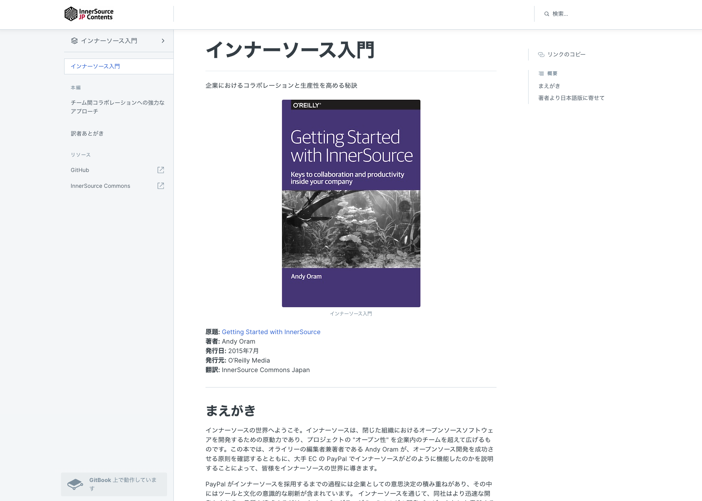
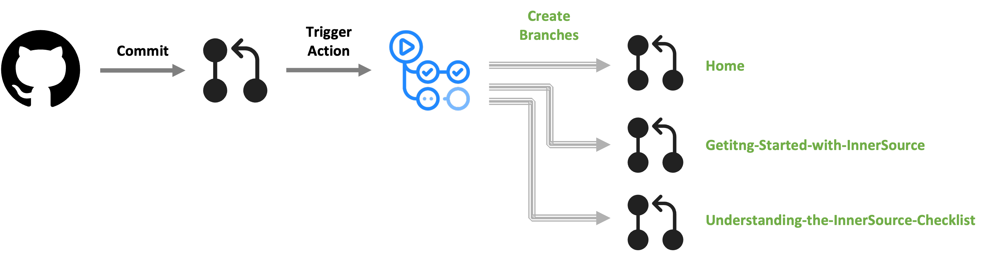

# InnerSource Japanese Translation Project

This is a repository for the translation of InnerSource Commons contents into Japanese.
Our first priority is to translate [InnerSource books](https://innersourcecommons.org/learn/books/).

## 日本語版について

本リポジトリのコンテンツは [GitBook](https://innersourcecommons.gitbook.io/jp-contents/) でホスティングされています。是非訪れてご覧ください。

## コントリビュートの方法

小さなものでも、大きなものでも、どのようなコントリビューションでも歓迎いたします！ コントリビューションの方法については、[CONTRIBUTING.md](CONTRIBUTING.md)ファイルをご覧ください。

## 翻訳の方針について

翻訳に際する用語や表現、文調などの基本的なポリシーは [TRANSLATION-POLICY.md](TRANSLATION-POLICY.md)ファイルをご覧ください。

## リリース方法について

本リポジトリはコンテンツのリリース先として GitBook を利用しています。GitBook における制限を考慮し、当リポジトリにおける各ブランチにコンテンツを割り振って GitBook の参照先としています。
これは日本コミュニティのコミット先のリポジトリをまとめることにより、トラステッドコミッターが日本語コンテンツに対して自治権を持ちやすくするためです。
このデプロイ方法は将来変更される可能性があります。
詳しくは GitHub Actions の挙動をご確認ください。

