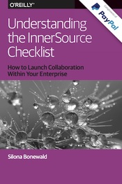
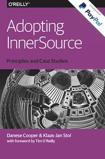

# コンテンツ一覧

国際的にインナーソースの動きを推進する InnerSource Commons では日本コミュニティによりインナーソースに関するコンテンツの日本語版が提供されています。是非お手に取ってご覧ください。
コミュニティにはコンテンツの拡充活動以外にもインナーソース実践者や、学びたい方を幅広い活動でサポートする体制があります。
インナーソース実践者や、学びたい方を幅広い活動でサポートします。
ぜひ [Slack](https://innersourcecommons-inviter.herokuapp.com/) にもお立ち寄り、コミュニティにご参加ください。

- [Slack のインバイトリンク](https://innersourcecommons-inviter.herokuapp.com/)
- [日本語 #jp-general チャンネル](https://app.slack.com/client/T04PXKRM0/C03M546NR16)
- [翻訳プロジェクト #jp-contents チャンネル](https://app.slack.com/client/T04PXKRM0/C03P1MVMBRS)

---

## [インナーソース入門](https://innersourcecommons.gitbook.io/books/v/getting-started-with-innersource/)

インナーソースの世界へようこそ。
インナーソースは、閉じた組織におけるオープンソースソフトウェアを開発するための原動力であり、プロジェクトの "オープン性" を企業内のチームを超えて広げるものです。
この本では、オライリーの編集者兼著者である Andy Oram が、オープンソース開発を成功させる原則を確認するとともに、大手 EC の PayPal でインナーソースがどのように機能したのかを説明することによって、皆様をインナーソースの世界に導きます。

---

## [インナーソースパターンブック](https://patterns.innersourcecommons.org/v/ja/)

インナーソース パターンとは、特定の形式で成文化された、文脈の理解、評価、および適用を容易にするインナーソースのベストプラクティスです。 この本には、InnerSource Commons によって収集された、最も成熟したパターンが含まれています。

---

## 詳解 インナーソース・チェックリスト (翻訳中)

Silona Bonewald が、オープンソースからの教訓を適用することによって、インナーソースのイニシアチブがあなたの会社において、どのように役立つのかを解説します。
このチェックリストはそれが会社全体であるのか、または1つのチームのために、インナーソースのアプローチを使用してソフトウェアを生成するために必要な様々なガイダンスとなります。

---

## Adopting InnerSource (Coming Soon)

Danese Cooper氏と Klaas-Jan Stol氏が、インナーソースがあなたの組織にとってどのように有用であるかを示すために、様々な企業でのケーススタディを紹介します。ケーススタディでは、これまでの進捗状況やメリットまたは負の影響と一緒に、インナーソースプロジェクトを開始することの難しさを率直に議論しています。
