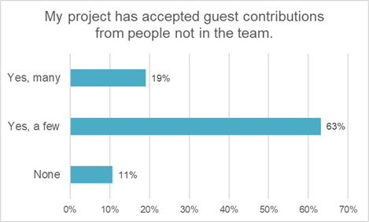
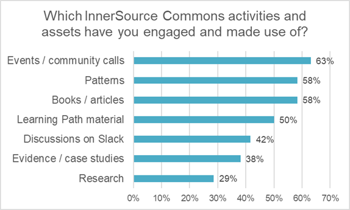

# State of Innersource

[State of InnerSource 2022 - 2023 RESULTS (innersourcecommons.org)](https://innersourcecommons.org/documents/surveys/State.of.InnerSource.Report.2022-2023.pdf)

# Intro

The InnerSource Commons community regularly runs the State of InnerSource survey to get feedback on the status of InnerSource within our community member organizations.
The survey is designed and rolled out by volunteers in the community.
We thank all those who were involved in this year’s effort.

# Contents

- Intro 1
- Contents 2
- InnerSource Concepts & Perceptions 3
    - InnerSource Concepts 3
    - Perceived InnerSource Benefits - Individuals 4
- InnerSource in Organizations 5
    - InnerSource Strategy 5
    - InnerSource Origins & Trajectory 6
    - Resourcing InnerSource 8
    - Organization Motivation & Progress 9
    - Metrics used to measure InnerSource progress 11
    - Tools used to measure InnerSource progress 12
  - InnerSource Blockers 13
- InnerSource Practices 14
    - Code Visibility & Discoverability 14
    - Contribution Practices 14
    - InnerSource Project Readiness 17
    - Team Practices 19
    - Rewards & Career 20
- InnerSource Commons Feedback 22
    - Resources to Get Started 22
    - InnerSource Commons Resources 23
- About the Survey 24
    - Methodology 24
    - Demographics 25
      - Gender 25
      - Role 25
      - Work Experience 26
    - Firmographics 27
      - Sector 27
      - Org & Dev Org Size 28
      - Geographic Location 29
- Acknowledgements 30
- About InnerSource Commons 30
    - Contact Information 30
    - Learn More 30

# InnerSource Concepts & Perceptions

## InnerSource Concepts

To start with we asked what respondents think of when they think of InnerSource.
The number one concept associated with InnerSource is adopting open source practices within the organization.
Re-use of software from other teams comes in as a close second.
Themes relatedto collaboration and learning across the organization come next.
Apart from the answers below,additional answers included sharing best practices, reducing duplication, and culture change.

**When I think of InnerSource, I think of…**

## Perceived InnerSource Benefits - Individuals

The top three perceived benefits the individual respondents noted were sharing knowledge, networking and increased enjoyment in their work.
It is interesting that the personal benefits reported do differ from the organizational motivations and measures included below.

**InnerSource has helped me and my team in the following ways…**

# InnerSource in Organizations

### InnerSource Strategy

The majority of respondents agree that InnerSource is both an important strategy in their organization (68%) and executive management explicitly supports InnerSource (65%).

**It is clear that InnerSource is an important strategy in my organization.**

**Executive management of my organization explicitly supports the InnerSource initiative.**

### InnerSource Origins & Trajectory

**How was InnerSource introduced to your company?**

39% of respondents said that the InnerSource in their organization started with a bottom-up initiative by one person or a few people.
Only 15% said that it started as a top-down initiative with some from management initiating the adoption.
A further 39% said it was a mix of both.

**How long ago was InnerSource first adopted in your organization?**

**How would you describe the current trajectory of InnerSource projects/programs at your organization?**

The vast majority of respondents reported that they were in the “scaling” phase of InnerSource adoption (64%), with a quarter tasked with rolling out InnerSource throughout their organization.

### Resourcing InnerSource

**What best describes the status of InnerSource programs or initiatives at your organization?**

The majority of respondents (78%) reported that they had an InnerSource Program in their organization, either formally or informally structured.
In addition to the formal programs, 43% of organizations said there are dedicated people in their organization focused exclusively on rolling out InnerSource, a similar 44% said there was not.

**How is InnerSource resourced in your organization?**

### **Organization Motivation & Progress**

We asked respondents to consider what motivated their organization to participate in InnerSource. 
We then asked which of those areas had seen measurable progress since adopting InnerSource.
Knowledge sharing was the most common motivation and area of progress, followed by removing silos and creating reusable software.

### Metrics used to measure InnerSource progress

We also asked, “How is progress or success of InnerSource measured?”, and received a very diverse set of answers.

Approximately 30% (of the 84 respondents answering this question) are not using metrics to assess progress.
The primary reason given for this is that they are at the beginning of their InnerSource journey (with some teams noting that they plan to start using metrics in the future).

The top three areas of focus for quantitative measurement of InnerSource success were:

1. Measuring consumption or reuse of InnerSource projects.
2. Measuring contributions and contributors.
3. Number of InnerSource projects or repos.

When describing the metrics used to measure these focus areas, here is what respondents
listed:

- Measuring consumption or reuse of InnerSource projects
    - Reuse/consumption/downloads of common InnerSource libraries or repos
    components
    - Number of external visitors to repositories
    - Number of users of developer framework
    - % of InnerSource repositories out of % of total repositories shared for whole
    company
    - Base documentation implemented across selected repos
    - README scores
- Measuring contributions and contributors. Some of the metrics outlined included:
    - Numbers of external/cross-team contributions e.g. lines of code / fork/clone/PRs
    and/or MRs
    - Numbers of contributors / external contributors to InnerSource initiatives
- Number of InnerSource projects or repos
    - Number of InnerSource projects (either self-declared or engaging with an ISPO)
    - Number of InnerSource repositories

To a lesser extent, measuring collaboration was also featured as a metric.
The number of collaborations taking place across teams, regions and roles; numbers of discussions on team channels; and the number of teams sharing best practice or knowledge being used as metrics.

Adoption and velocity were also named as key indicators of progress amongst much smaller cohorts of respondents.

Almost 29% (of 84 respondents) stated that they used more than one tool or approach to measure InnerSource progress or adoption.

### Tools used to measure InnerSource progress

The majority of respondents did not explicitly name the tools or platforms they use to measure progress.
15 different tools/platforms were referenced.
Overall, customized tools or graphs, GitHub stats, GitLab stats and Grimoire Labs appear to be most commonly used tools for measurement.

A very small number of organizations also referred to qualitative approaches to measure progress such as inviting structured feedback from staff and management or using informal feedback.

Employee satisfaction rates are also a significant indicator of InnerSource progress.
A very small number of respondents (5%) referred to using surveys on participant satisfaction or developer experience.
However, some of the qualitative approaches around structured feedback may also be used to assess employee satisfaction.

Just over a quarter of survey respondents noted demonstrable progress in project velocity.
However, only 4% of the teams answering this question used metrics to measure increases in velocity.
Once again, progress in this area has been reported on an anecdotal basis.

## InnerSource Blockers

The top three blockers associated with InnerSource were time to contribute, lack of middle management buy-in and a lack of familiarity with InnerSource principles.

The time factor featured heavily when respondents were invited to comment further on obstructions to InnerSource in their organizations.
There were also a substantial number of comments on the need for greater support from team/unit managers or direct line managers to facilitate engagement in InnerSource.

From the comments associated with this question, getting buy-in at the initial stages also appears to be a very significant blocker in terms of selecting projects that people want/need to work on and addressing a wider lack of interest from developers.

# InnerSource Practices

### Code Visibility & Discoverability

57% of respondents said the source code of the InnerSource project they are working on is visible to everybody within their organization.
14% it is visible, only upon request.
From the comments associated with this question, it appears that code visibility is dependent on, and varies by, the project within organizations.

Almost half (49%) of the respondents said there was a standardized way to “register” or “advertise” projects as InnerSource in their organization.

### Contribution Practices

**People within my organization are afforded time to contribute to InnerSource projects.**

**People within my organization can choose what projects to work on based on their expertise and motivations.**

**Developers in my organization are supported and encouraged to make guest contributions to projects outside their departments / business units / teams.**

**My project has accepted guest contributions from people not in the team.**

### InnerSource Project Readiness

**Members of my team have experience accepting guest contributions from people outside the team.**

### Team Practices

### Rewards & Career

**My organization offers rewards for people who make guest contributions to projects owned by other teams.**

**My organization has defined criteria for career promotions based on InnerSource values and contributions.**

**My organization supports a path for career advancement that does not require management.**

# InnerSource Commons Feedback

### Resources to Get Started

### InnerSource Commons Resources

**Which InnerSource Commons activities and assets have you engaged and made use of?**

**What features or content could be added to make InnerSource Commons more useful to you?**

# About the Survey

### Methodology

The State of InnerSource Survey 2022-2023 was designed collaboratively by the InnerSource Commons community.
We designed an online questionnaire based on last year’s survey which was in turn based on Silona Bonewald’s book “Understanding the InnerSource Checklist”.
Silona’s checklist is an excellent starting point for any organization to understand whether they are ‘ready’ for InnerSource.
Questions were reviewed and revised at the InnerSource Gathering that took place in Dublin in Sep 2022, and thereafter in the ISC #survey Slack channel.

The questionnaire was administered using SurveyMonkey, and was open for approximately 12 weeks in November-January 2022/2023.
The survey was promoted within the InnerSource Commons Community (on Slack and on our Newsletter) and also across our social media channels.
We had 112 respondents to the survey.
Not every respondent answered every question.
We removed respondents who only filled in their contact details but didn’t answer any questions.

If you have any feedback on the survey or would like to get involved in future surveys, please reach out to [info@innersourcecommons.org](mailto:info@innersourcecommons.org).

### Demographics

#### Gender
From our demographics we can see an expected gender split with a majority of male respondents (76%).
However, it is worth noting that the 17% female representation is more than many estimates of female contributors in the open source ecosystem.

#### Role
Respondents had a range of roles.
38% of respondents who specified their role indicated to have a specialized InnerSource role, such as InnerSource Program Manager, Officer, Evangelist, or Lead.
25% identified as developer or DevOps specialist.
Other roles included engineering manager (ca. 7%), senior executive (ca. 6%), and product managers and process improvement specialists (ca. 6%).

#### Work Experience
Most respondents had 10+ years of experience.

### Firmographics

#### Sector
As in previous years, respondents are working in a wide range of domains, with technology being the largest.
The category technology obviously comprises a wide range of companies offering many different types of services and products.
As in previous surveys, several respondents work in the financial services domain.

#### Org & Dev Org Size
Half of our respondents came from very large organizations (20,000+), and there was a wide spread of size of developer organization.

#### Geographic Location
Respondents came from over 20 different countries, but over 40% of the respondents came from Germany and the United States

# Acknowledgements

Thanks to all who have helped us create and run this survey including: Addie Girouard, Ciara Flanagan, Clare Dillon, Dmitrii Sugrobov, Katie Schueths, Niall Maher, Tom Sadler, and Zack Koppert.

# About InnerSource Commons

InnerSource Commons is the world’s largest community of InnerSource practitioners.
It is dedicated to creating and sharing knowledge about InnerSource, the use of open source best practices for software development within the confines of an organization.
InnerSource helps organizations experience the benefits of using open source methods: reducing bottlenecks, increasing efficiencies, and creating happier developers.

Founded in 2015, the InnerSource Commons is now supporting and connecting over 2,500 individuals from over 750 companies, academic institutions, and government agencies.
The InnerSource Commons Foundation was incorporated on February 19th, 2020 and is now a 501(c)(3) public charity.

# Contact Information

You can reach us at [info@innersourcecommons.org](mailto:info@innersourcecommons.org) or visit the InnerSource Commons Slack.

# Learn More

Check out the InnerSource Commons website at [www.innersourcecommons.org](http://www.innersourcecommons.org/) to find more resources such as our Learning Path, Patterns, Events, Research and more.